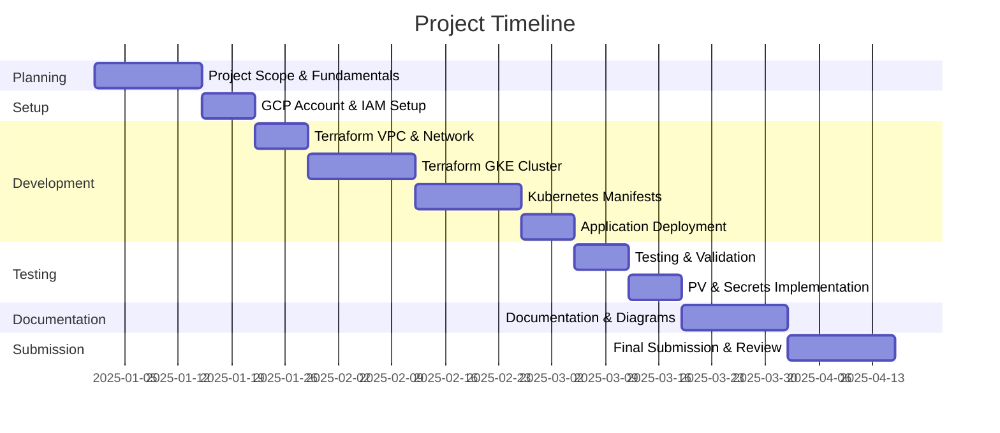

# 📋 Project Proposal

## Automated Deployment of Multi-tier WordPress Application on GKE using Terraform

---

## 👤 Student Information

| Field | Details |
|-------|---------|
| **Student Name** | Mohd Sabir |
| **Course** | Master of Computer Applications (MCA) |
| **Project Type** | Final Year Project |

---

## 📝 Abstract

This project focuses on establishing a comprehensive **infrastructure automation** and **application deployment pipeline** using Terraform and Google Cloud Platform (GCP). The primary objective is to provision all required GCP resources—including Google Kubernetes Engine (GKE), Virtual Private Cloud (VPC), subnets, firewall rules, and Identity and Access Management (IAM) roles—through **Infrastructure as Code (IaC)** using Terraform.

After provisioning the infrastructure, a **multi-tier open-source application** consisting of WordPress as the frontend and MySQL as the backend will be deployed on the Kubernetes cluster. The project demonstrates how DevOps principles, container orchestration, and cloud-native technologies can be integrated to achieve automated, scalable, and repeatable deployments.

### Key Concepts Explored

- 🐳 Containerization
- ⚙️ Kubernetes Services
- 💾 Persistent Storage
- 🔐 Secret Management
- 🔄 Environment Lifecycle Management

> This proof-of-concept highlights the reliable creation and teardown of production-like environments using Terraform scripts and Kubernetes YAML manifests.

---

## 📌 Assumptions / Declarations

| # | Assumption |
|---|------------|
| 1 | A **GCP Free Tier** account will be used for all development and testing activities |
| 2 | All infrastructure components (VPC, GKE cluster, service accounts, storage) will be provisioned using **Terraform** |
| 3 | Application components (WordPress and MySQL) will be deployed using **Kubernetes manifests** on the GKE cluster |
| 4 | The system is developed for **educational and proof-of-concept purposes** and is not optimized for production-scale or high-availability workloads |
| 5 | A standard development laptop running Windows, macOS, or Linux will be used for development and CLI operations |

---

## 🎯 Main Objectives / Deliverables

### Primary Objectives

- [x] **Automate** the creation and management of GCP infrastructure using Terraform
- [x] **Deploy** a multi-tier containerized WordPress application with a MySQL backend on GKE
- [x] **Implement** core Kubernetes features:
  - Persistent Volumes
  - ConfigMaps
  - Secrets
  - LoadBalancer Services
- [x] **Demonstrate** practical implementation of IaC and DevOps principles
- [x] **Provide** complete documentation and architecture diagrams explaining the deployment workflow

### Deliverables

| Deliverable | Description |
|-------------|-------------|
| Terraform Code | Modular IaC for GCP infrastructure |
| Kubernetes Manifests | YAML files for WordPress & MySQL deployment |
| Documentation | README, Architecture diagrams, Deployment guide |
| Presentation | Project presentation slides |
| Demo | Working WordPress application on GKE |

---

## 📅 Timeline and Milestones

### Detailed Timeline

| Week | Phase | Activities |
|------|-------|------------|
| **Week 1-2** | 📚 Learning | Understanding project scope, GCP basics, and Terraform fundamentals |
| **Week 3** | 🔧 Setup | GCP account setup, IAM configuration, and enabling required APIs |
| **Week 4** | 🌐 Networking | Writing Terraform code for VPC, subnets, firewall rules, and service accounts |
| **Week 5-6** | ☸️ Kubernetes | Terraform-based GKE cluster creation |
| **Week 7-8** | 🐳 Containers | Dockerizing WordPress and MySQL, creating Kubernetes YAML manifests |
| **Week 9** | 🚀 Deployment | Deploying the application to GKE using kubectl or GitOps approach |
| **Week 10** | ✅ Testing | Testing application availability and functionality using LoadBalancer IP |
| **Week 11** | 🔐 Security | Implementing Persistent Volumes and Secret management |
| **Week 12-13** | 📄 Documentation | Preparing project documentation and architecture diagrams |
| **Week 14+** | 📋 Submission | Final report submission, presentation, and code review |

---

## 🛠️ Tools to be Used

### Software Stack

| Tool | Category | Description |
|------|----------|-------------|
|  | IaC | Infrastructure as Code tool for GCP |
|  | Cloud | Cloud provider and deployment environment |
|  | Orchestration | Kubernetes-based container orchestration (GKE) |
|  | Containers | Containerization of WordPress and MySQL |
|  | CLI | Kubernetes command-line tool |
|  | IDE | Code editor / Integrated Development Environment |
|  | VCS | Version control and source code management |
|  | Repository | Code hosting and collaboration |

### Hardware Requirements

| Component | Minimum Requirement |
|-----------|---------------------|
| **RAM** | 4 GB (8 GB recommended) |
| **Storage** | 20 GB free space |
| **Network** | Stable internet connectivity |
| **OS** | Windows 10+, macOS, or Linux |

---

## 📖 Learning Involved

### Core Learning Areas

#### 1. Infrastructure as Code (IaC)
> Automating infrastructure provisioning using Terraform

- Terraform modules and state management
- Provider configuration
- Resource dependencies
- Output variables

#### 2. GCP Networking and IAM
> Designing secure and scalable cloud environments

- VPC and subnet design
- Firewall rules
- Service accounts
- IAM role bindings

#### 3. Kubernetes Workloads
> Managing Pods, Services, Persistent Volumes, and Secrets

- Deployments and ReplicaSets
- Services (ClusterIP, LoadBalancer)
- ConfigMaps and Secrets
- Persistent Volume Claims

#### 4. Helm (Optional)
> Managing complex Kubernetes deployments using Helm charts

- Chart creation
- Values files
- Release management

#### 5. CI/CD and GitOps (Optional)
> Exploring automated deployment pipelines

- GitHub Actions
- ArgoCD
- Continuous deployment

#### 6. DevOps Principles
> Applying automation, reproducibility, and lifecycle management

- Infrastructure automation
- Configuration management
- Environment parity

#### 7. Documentation and Cloud Architecture
> Creating structured technical documentation and architecture diagrams

- Architecture diagrams
- README files
- Deployment guides

---

## 📊 Expected Outcomes

Upon successful completion of this project:

1. ✅ Fully automated GCP infrastructure deployment
2. ✅ Working WordPress + MySQL application on GKE
3. ✅ Comprehensive documentation
4. ✅ Reusable Terraform modules
5. ✅ Understanding of cloud-native deployment patterns

---

## 📚 References

- [Terraform Documentation](https://www.terraform.io/docs)
- [Google Cloud Documentation](https://cloud.google.com/docs)
- [Kubernetes Documentation](https://kubernetes.io/docs)
- [WordPress Docker Image](https://hub.docker.com/_/wordpress)
- [MySQL Docker Image](https://hub.docker.com/_/mysql)

---

## ✍️ Approval

| Role | Name | Signature | Date |
|------|------|-----------|------|
| **Student** | Mohd Sabir | | |
| **Guide/Mentor** | | | |
| **HOD** | | | |

---

**MCA Final Year Project Proposal**

*Submitted for approval*

